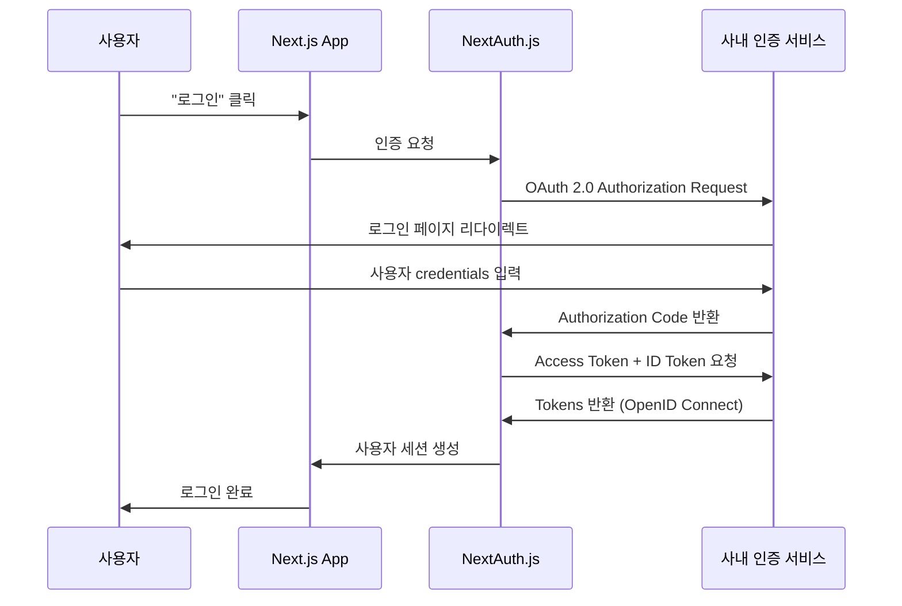

# NextAuth.js + OpenID Connect + OAuth 2.0 
NextAuth.js를 활용한 OpenID Connect + OAuth 2.0 인증 서비스 연동이 필요해서 정리함

### 현재 상황
1. 통합 플랫폼에서 인증 관련 인프라를 운영 예정
2. 각각의 독립된 서비스들이 존재함

#### 통합 플랫폼
```
├── OpenID Connect + OAuth 2.0 기반 인증 서비스 
├── 서비스 A
├── 서비스 B
└── 기타 서비스들
```
<!--
#### 아키텍처 특징
- 각 서비스는 고유한 사용자 기반을 가짐 (SSO 미적용)
- 인증 인프라를 공유해서 플랫폼 레벨에서 OAuth 2.0 + OIDC 기반 인증 서비스 제공
- 각 서비스는 비즈니스 로직에 집중하고 인증은 표준 프로토콜로 연동
-->
### OAuth 2.0
- 타사 서비스 계정을 통한 인증/인가를 위한 표준 프로토콜
- 리소스 접근 권한 위임(Authorization)하기 위해 사용됨
- 특징: 
  - 사용자 credentials를 직접 관리하지 않음
  - Access Token 기반 인증
  - 보안성과 확장성 제공

### OpenID Connect (OIDC)
- OAuth 2.0 위에 구축된 신원 확인 레이어
- 사용자의 정보를 제공함 (Authentication)
- 특징:
  - OAuth 2.0 + 사용자 신원 정보
  - ID Token을 통한 사용자 프로필 데이터 제공
  - JWT 기반 토큰 구조

### NextAuth.js
- Next.js 애플리케이션용 완전한 인증 솔루션
- 특징:
  - 다양한 Provider 지원 (Google, GitHub, Discord 등)
  - 세션 관리 자동화
  - 토큰 갱신 처리

## 인증 흐름




## OAuth 2.0 vs OpenID Connect 비교

#### OAuth 2.0
- 목적: 권한 위임 (Authorization)
- 제공: 접근 권한
- 토큰: Access Token
- 사용: API 접근 권한
#### OpenID Connect
- 목적: 신원 확인 (Authentication)
- 제공: 접근 권한 + 사용자 정보
- 토큰: Access Token + ID Token
- 사용: 로그인 + API 접근

### 실제 동작 차이점

**OAuth 2.0만 사용시:**
```javascript
// 단순히 접근 권한만 확인
{
  "access_granted": true,
  "scope": ["read", "write"]
}
```

**OpenID Connect 추가시:**
```javascript
// 사용자 정보까지 함께 제공
{
  "access_granted": true,
  "scope": ["read", "write", "openid"],
  "user_info": {
    "sub": "1234567890",
    "name": "홍길동",
    "email": "hong@example.com",
    "picture": "https://example.com/avatar.jpg"
  }
}
```

### 보안 측면
- 사용자 비밀번호 직접 관리 불필요
- 검증된 OAuth Provider의 보안 인프라 활용
- 토큰 기반 인증으로 세션 보안 강화

### 개발 효율성
- NextAuth.js가 복잡한 인증 로직 추상화
- 다양한 Provider 통합 인터페이스 제공
- 세션 관리, 토큰 갱신 자동 처리

### 사용자 경험
- 기존 계정을 통한 원클릭 로그인 (최초 인증 플랫폼 가입은 필요함)
- 별도의 서비스별 회원가입 프로세스 불필요
- 신뢰할 수 있는 Provider를 통한 안전한 인증

### NextAuth.ts 설정 파일
```ts
// api.auth/[...nextauth]/route.ts
import NextAuth from 'next-auth';
import type { NextAuthOptions } from 'next-auth';
import { OAuthConfig } from 'next-auth/providers/oauth';

// 인증 관련 설정을 담는 객체: 로그인 방식, 세션 관리 방법을 정의함
const authOptions: NextAuthOptions = {
  debug: true,
  providers: [ // 어떤 방식으로 로그인 할지 정의: 나의 경우 사내 인증 시스템이므로 custom provider를 정의
    { 
      id: 'testid',  // 인증 방식 이름 정의: 코드에서 signIn('testid')로 사용함
      name: 'SignIn With AuthX',  // 사용자에게 보여질 로그인 버튼의 이름
      type: 'oauth', // 다른 서비스를 통해서 로그인하겠다는 의미
      clientId: process.env.AUTH_CLIENT_ID,  // 인증 서비스에서 발급 받은 앱ID로 공개된 정보
      // cliendSecret은 인증 서버에서 발급 받은 비밀키로 보안정보를 넣는데 나의 경우 인증 방식이 PKCE라서 안보냄
      issuer: 'OpenID Connect 인증 서버 URL' // 인증 서버의 기본 URL 주소로 구글 이라면: https://accounts.google.com
      authorization: {
        url: 'https://api.cadiacinsight.com/v1/authorize',
        params: {
          scope: 'openid',
          response_type: 'code',
        },
      },
      token: {
        url: 'https://api.cadiacinsight.com/v1/token',
        params: {
          grant_type: 'authorization_code',
        },
      },
      userinfo: 'https://api.cadiacinsight.com/v1/userinfo',
      checks: ['pkce', 'state'],
      idToken: false,
      profile(profile) {
        return {
          id: profile.sub,
          name: profile.name,
          email: profile.email,
          image: profile.picture,
        };
      },
    } as OAuthConfig<any>,
  ],
  session: {
    strategy: 'jwt',
  },
  callbacks: {
    async signIn({ user, account, profile, email, credentials }) {
      console.log('signIn callback:', { user, account, profile, email, credentials });
      return true;
    },
    async jwt({ token, account, profile, user }) {
      console.log('jwt callback:', { token, account, profile, user });
      if (account) {
        token.accessToken = account.access_token;
        token.refreshToken = account.refresh_token;
      }
      if (profile) {
        token.sub = profile.sub;
        token.name = profile.name;
        token.email = profile.email;
        token.picture = profile.picture;
      }
      return token;
    },
    async session({ session, token }) {
      console.log('session callback:', { session, token });
      if (token) {
        session.user = {
          name: token.name,
          email: token.email,
          image: token.picture,
        };
      }
      return session;
    },
  },
  events: {
    async signIn(message) {
      console.log('signIn event:', message);
    },
    async signOut(message) {
      console.log('signOut event:', message);
    },
    async createUser(message) {
      console.log('createUser event:', message);
    },
    async updateUser(message) {
      console.log('updateUser event:', message);
    },
    async linkAccount(message) {
      console.log('linkAccount event:', message);
    },
    async session(message) {
      console.log('session event:', message);
    },
  },
  pages: {
    signIn: '/login',
  },
};

const handler = NextAuth(authOptions);

export { handler as GET, handler as POST };
```


*참고*
- [NextAuth.js 공식 문서](https://next-auth.js.org/)
- [OAuth 2.0 RFC 6749](https://datatracker.ietf.org/doc/html/rfc6749)
- [OpenID Connect 1.0 Specification](https://openid.net/connect/)
