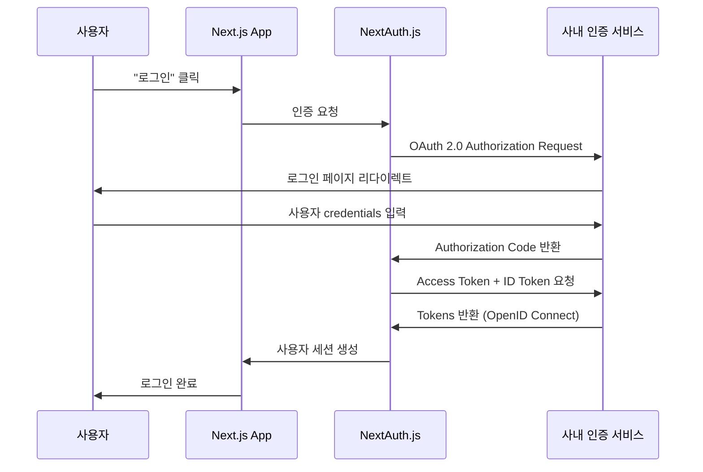

# NextAuth.js + OpenID Connect + OAuth 2.0 
NextAuth.js를 활용한 OpenID Connect + OAuth 2.0 인증 서비스 연동이 필요해서 정리함

### 현재 상황
1. 통합 플랫폼에서 인증 관련 인프라를 운영 예정
2. 각각의 독립된 서비스들이 존재함

#### 통합 플랫폼
```
├── OpenID Connect + OAuth 2.0 기반 인증 서비스 
├── 서비스 A
├── 서비스 B
└── 기타 서비스들
```
<!--
#### 아키텍처 특징
- 각 서비스는 고유한 사용자 기반을 가짐 (SSO 미적용)
- 인증 인프라를 공유해서 플랫폼 레벨에서 OAuth 2.0 + OIDC 기반 인증 서비스 제공
- 각 서비스는 비즈니스 로직에 집중하고 인증은 표준 프로토콜로 연동
-->
### OAuth 2.0
- 타사 서비스 계정을 통한 인증/인가를 위한 표준 프로토콜
- 리소스 접근 권한 위임(Authorization)하기 위해 사용됨
- 특징: 
  - 사용자 credentials를 직접 관리하지 않음
  - Access Token 기반 인증
  - 보안성과 확장성 제공

### OpenID Connect (OIDC)
- OAuth 2.0 위에 구축된 신원 확인 레이어
- 사용자의 정보를 제공함 (Authentication)
- 특징:
  - OAuth 2.0 + 사용자 신원 정보
  - ID Token을 통한 사용자 프로필 데이터 제공
  - JWT 기반 토큰 구조

### NextAuth.js
- Next.js 애플리케이션용 완전한 인증 솔루션
- 특징:
  - 다양한 Provider 지원 (Google, GitHub, Discord 등)
  - 세션 관리 자동화
  - 토큰 갱신 처리

## 인증 흐름




## OAuth 2.0 vs OpenID Connect 비교

#### OAuth 2.0
- 목적: 권한 위임 (Authorization)
- 제공: 접근 권한
- 토큰: Access Token
- 사용: API 접근 권한
#### OpenID Connect
- 목적: 신원 확인 (Authentication)
- 제공: 접근 권한 + 사용자 정보
- 토큰: Access Token + ID Token
- 사용: 로그인 + API 접근

### 실제 동작 차이점

**OAuth 2.0만 사용시:**
```javascript
// 단순히 접근 권한만 확인
{
  "access_granted": true,
  "scope": ["read", "write"]
}
```

**OpenID Connect 추가시:**
```javascript
// 사용자 정보까지 함께 제공
{
  "access_granted": true,
  "scope": ["read", "write", "openid"],
  "user_info": {
    "sub": "1234567890",
    "name": "홍길동",
    "email": "hong@example.com",
    "picture": "https://example.com/avatar.jpg"
  }
}
```

### 보안 측면
- 사용자 비밀번호 직접 관리 불필요
- 검증된 OAuth Provider의 보안 인프라 활용
- 토큰 기반 인증으로 세션 보안 강화

### 개발 효율성
- NextAuth.js가 복잡한 인증 로직 추상화
- 다양한 Provider 통합 인터페이스 제공
- 세션 관리, 토큰 갱신 자동 처리

### 사용자 경험
- 기존 계정을 통한 원클릭 로그인 (최초 인증 플랫폼 가입은 필요함)
- 별도의 서비스별 회원가입 프로세스 불필요
- 신뢰할 수 있는 Provider를 통한 안전한 인증

# NextAuth.js 설정 파일
```ts
// api.auth/[...nextauth]/route.ts
import NextAuth from 'next-auth';   
import type { NextAuthOptions } from 'next-auth'; 
import { jwtDecode } from 'jwt-decode';

// 인증 관련 설정을 담는 객체: 로그인 방식, 세션 관리 방법을 정의함
const authOptions: NextAuthOptions = {
  debug: true,  // 개발 중 콘솔에 로그 출력 하도록
  providers: [  // 어떤 방식으로 로그인 할지 정의: 나의 경우 사내 인증 시스템이므로 custom provider를 정의
    {
      id: 'testid',  // 인증 방식 이름 정의: 코드에서 signIn('testid')로 사용함
      name: '인증 서비스로 로그인하기',  // 사용자에게 보여질 로그인 버튼의 이름
      type: 'oauth',
      clientId: process.env.AUTH_CLIENT_ID,  // 인증 서비스에서 발급 받은 앱ID(공개된 정보)
      // cliendSecret은 인증 서버에서 발급 받은 비밀키로 보안정보를 넣는데 나의 경우 인증 방식이 PKCE라서 안보냄
      wellKnown:
        'https://api.cadiacinsight.com/.well-known/openid-configuration',
      issuer: '[OpenID Connect 인증 서버 URL]', // 인증 서버의 기본 URL 주소로 구글 이라면: https://accounts.google.com
      // 이슈로 인해 주석처리
      // authorization: {
      //  url: '[인증 서버 URL]/v1/authorize',  // 사용자가 로그인할 실제 페이지 주소
      //  params: {
      //    scope: 'openid',  // 기본 사용자 정보(이름, 이메일 등)를 요청
      //    response_type: 'code',  // 보안상 안전한 인증 코드 방식 사용
      //  },
      },
    token: '[인증 서버 URL]/v1/token',  // 인증 코드를 실제 토큰으로 바꿔주는 API 주소
    userinfo: '[인증 서버 URL]/v1/userinfo',  // 토큰으로 사용자 정보를 가져오는 API 주소
    checks: ['pkce', 'state', 'nonce'],  // 보안 검증 추가. pkce(코드 가로채기 방지), state(가짜 로그인 방지), nonce(토큰 재사용 공격 방지) 
    idToken: true,   // ID 토큰을 사용하겠다 (사용자 정보 포함)
    client: {
      token_endpoint_auth_method: 'none',  // 토큰 요청할 때 client secret 사용하지 않음: PKCE를 사용해서 없어도 안전함
    },
    profile(profile) {  // 인증 서비스에서 받은 사용자 정보를 웹에서 쓸 형식으로 변환
      return {
        id: profile.sub,
        name: profile.name,
        email: profile.email,
        image: profile.picture,
      };
    },
  session: { 
    strategy: 'jwt',  // jwt 토큰으로 로그인 상태를 관리함
  },
  async jwt({ token, account, profile, user }) { // 인증 서비스에서 받은 ID 토큰을 해독해서 사용자 정보를 추출, 로그인 성공 직후, 페이지 새로고침할 때마다 실행
    ....
    return token; // 실무에선 jwtDecode 사용해서 디코딩 후 리턴
  },
  async signIn({ user, account, email, credentials }) { // 사용자가 로그인을 시도할 때 실행됨. 로그인을 허용할지 말지 결정(true: 허용, false: 거부)
    // 사용자 검증 로직 추가 가능
    return true;
  },
  async session({ session, token }) {
    // 프론트에서 useSession() 호출할 때마다 실행. JWT 토큰의 정보를 세션 객체로 변환
    if (token) {
      session.user = {
        ....
      };
    }
  return session; // 이 정보가 useSession().data.user
},
// 이걸 살려두면 로그인 시도 시 프론트의 /login 사용, 주석처리 시 인증서비스에서 제공되는 로그인 페이지 사용
// pages: { 
//   signIn: '/login',
// },
- 주석 처리되어 있어서 NextAuth 기본 로그인 페이지 사용
- 주석 해제하면 `/login` 페이지로 사용자 정의 로그인 페이지 사용

const handler = NextAuth(authOptions);

// /api/auth/[...nextauth] 경로로 오는 모든 인증 요청 처리
export { handler as GET, handler as POST };
```

#### ERROR 발생
```text
https://next-auth.js.org/errors#oauth_callback_error jwks_uri must be configured on the issuer {
  error: [Error [OAuthCallbackError]: jwks_uri must be configured on the issuer] {
    code: undefined
  },
  providerId: 'testid',
  message: 'jwks_uri must be configured on the issuer'
}
```
- 내가 설정한 OpenID Connect Provider에 `jwks_uri` 값이 누락되거나 유효하지 않아서 NextAuth가 에러를 발생시킴
- `jwks_uri`:
  - JSON Web Key Set (JWKs)을 제공하는 URL 
  - 인증 서버가 본인의 공개키를 브라우저나 클라이언트에게 제공하기 위한 주소
  - 이 키를 이용해 `id_token`이나 `access_token`의 서명을 검증할 수 있어야하기 때문에 반드시 있어야하는 값이다.

#### 해결 방법
- 설정에 `wellknown`이 있으면 NextAuth가 알아서 `.well-known/openid-configuration`을 파싱해서 필요한 값(jwks_uri, authorization_endpoint, 등)을 자동으로 가져감
- 그런데 내가 설정한 것 처럼 `authorization, token, userinfo`를 수동으로 지정했을 경우 `jwks_uri`도 직접 명시하거나 `wellKnown`에서 자동 추출되길 기대함
- 결론: `wellKnown` 설정만 추가한 나머지는 제거한다. (**가장 안전하고 권장되는 방식**)


## 전체 로그인 흐름

1. `사용자`: "로그인" 버튼 클릭 → `signIn('testid')` 호출
2. `NextAuth`: Healthcare Platform 로그인 페이지로 리다이렉트
3. `인증 서비스`: 사용자 인증 후 인증 코드 반환
4. `NextAuth`: 인증 코드를 토큰으로 교환
5. `JWT 콜백`: ID 토큰 해독해서 사용자 정보 추출
6. `SignIn 콜백`: 로그인 허용 여부 결정
7. `프론트엔드`: `useSession()`으로 로그인 상태 및 사용자 정보 접근

### 로그인 적용
```tsx
import { redirect } from 'next/navigation';

export default function HomePage() {
  redirect('/api/auth/signin/testid');
}
```
- 사용자가 "/" 접근 시 서버 컴포넌트에서 `/api/auth/signin/testid`로 리다이렉트 해야하는 경우
- NextAuth가 자동으로 생성하는 OAuth 로그인 엔드포인트를 넣어줌
  - `/api/auth/signin/testid`는 NextAuth에서 자동으로 제공하는 API 라우트 이지만
  - NextAuth가 내부적으로 이 경로에 로그인 페이지로 리다이렉트하는 처리를 해두었기 때문에 렌더링됨
- 서버 컴포넌트로 유지되어 SSR 성능상 최적화를 할 수 있고
- NextAuth의 표준 OAuth 플로우를 사용하게됨

*하지만 위의 코드는 문제가 있다.*
- 로그인을 한 유저, 안한 유저 모두 루트 페이지에 접근하면 로그인 페이지로 빠진다.
- 그래서 세션 상태에 따라 로직 처리가 필요하다.
- `app/page.tsx`는 어떻게 서버 컴포넌트를 유지하며 세션 값을 알 수 있을까?

```tsx
// app/page.tsx

import { getServerSession } from 'next-auth';
import { authOptions } from './api/auth/[...nextauth]/route';

async function ServerComponent() {
 const session = await getServerSession(authOptions);
 
 if (!session) return <p>Not logged in</p>;
 
 return <p>Hello {session.user.name}!</p>;
}
```

### getServerSession
- 서버에서 즉시 세션 정보를 가져와서 로딩 없이 바로 보호된 컨텐츠를 렌더링 할 수 있게 해주는 NextAuth 함수 👉 `Server Component`에서 사용
- 성능 최적화를 위해선 세션 캐싱도 제공한다 `getCachedSession()`

### useSession
- NextAuth.js에서 제공하는 React Hook 👉 `Client Component`에서 사용
- 현재 세션 상태를 관리하고 인증 정보에 접근할 수 있도록 함
- 내부적으로 Context API와 SWR을 사용해서 세션 데이터를 캐싱하고 동기화 

<br/>
<br/>
<br/>

*참고*
- [NextAuth.js 공식 문서](https://next-auth.js.org/)
- [OAuth 2.0 RFC 6749](https://datatracker.ietf.org/doc/html/rfc6749)
- [OpenID Connect 1.0 Specification](https://openid.net/connect/)
